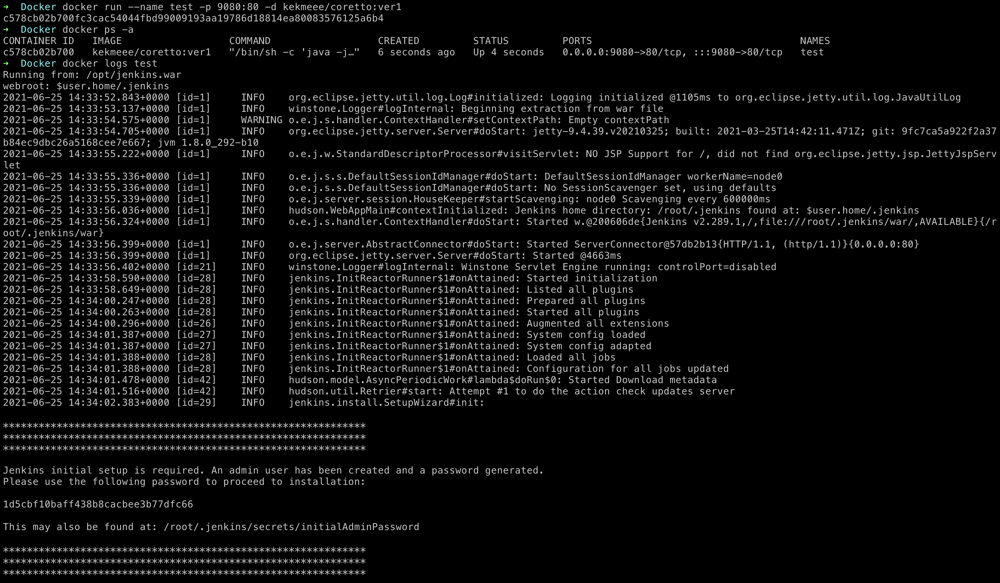
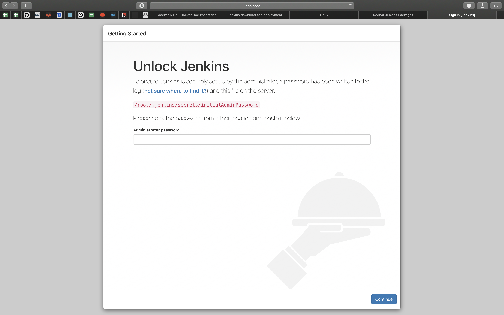
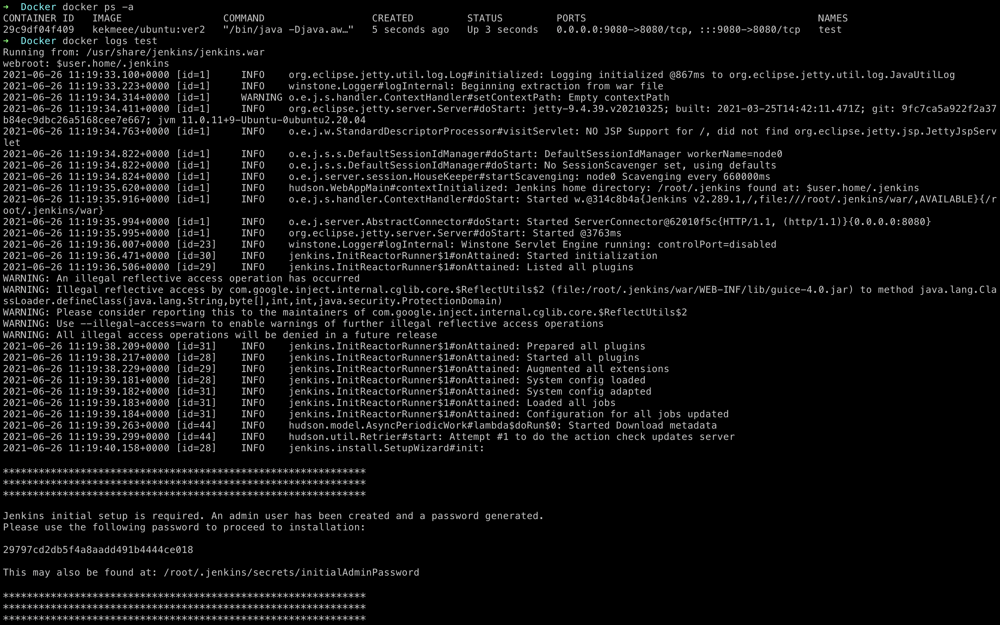
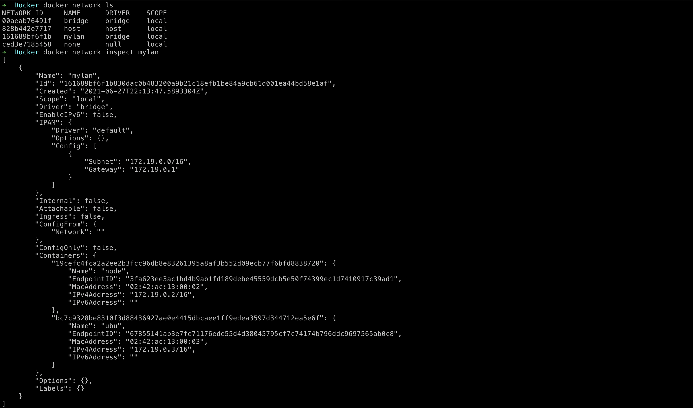

Домашняя работа по занятию "5.4. Практические навыки работы с Docker"
==

1. В данном задании вы научитесь изменять существующие Dockerfile, адаптируя их под нужный инфраструктурный стек.

Измените базовый образ предложенного Dockerfile на Arch Linux c сохранением его функциональности.

```text
FROM ubuntu:latest

RUN apt-get update && \
    apt-get install -y software-properties-common && \
    add-apt-repository ppa:vincent-c/ponysay && \
    apt-get update
 
RUN apt-get install -y ponysay

ENTRYPOINT ["/usr/bin/ponysay"]
CMD ["Hey, netology”]
```

Для получения зачета, вам необходимо предоставить:
- Написанный вами Dockerfile
- Скриншот вывода командной строки после запуска контейнера из вашего базового образа
- Ссылку на образ в вашем хранилище docker-hub

<h3>Ответ:</h3>

-  Dockerfile:

````text
FROM archlinux:latest

RUN pacman -Syyu --noconfirm && \
    echo "ppa:vincent-c/ponysay" >> /etc/pacman.conf && \
    pacman -Syyu --noconfirm

RUN pacman -Sy --noconfirm ponysay

ENTRYPOINT ["/usr/bin/ponysay"]
CMD ["Hey, netology”]
````

-  Скриншот:


- [Ссылка](https://hub.docker.com/repository/docker/kekmeee/arch) на репозиторий Docker Hub.

---

2. В данной задаче вы составите несколько разных Dockerfile для проекта Jenkins, опубликуем образ в `dockerhub.io` и
   посмотрим логи этих контейнеров.

- Составьте 2 Dockerfile:

    - Общие моменты:
        - Образ должен запускать [Jenkins server](https://www.jenkins.io/download/)
        
    - Спецификация первого образа:
        - Базовый образ - [amazoncorreto](https://hub.docker.com/_/amazoncorretto)
        - Присвоить образу тэг `ver1` 
    
    - Спецификация второго образа:
        - Базовый образ - [ubuntu:latest](https://hub.docker.com/_/ubuntu)
        - Присвоить образу тэг `ver2` 

- Соберите 2 образа по полученным Dockerfile
- Запустите и проверьте их работоспособность
- Опубликуйте образы в своём dockerhub.io хранилище

Для получения зачета, вам необходимо предоставить:
- Наполнения 2х Dockerfile из задания
- Скриншоты логов запущенных вами контейнеров (из командной строки)
- Скриншоты веб-интерфейса Jenkins запущенных вами контейнеров (достаточно 1 скриншота на контейнер)
- Ссылки на образы в вашем хранилище docker-hub

<h3>Ответ:</h3>

- Первый образ:
  - Dockerfile:
    ````text
    FROM amazoncorretto:latest
    COPY ./jenkins.war /opt/jenkins.war
    EXPOSE 80/tcp
    ENTRYPOINT ["java", "-jar", "/opt/jenkins.war", "--httpPort=80"]
    ````
  - Скриншот логов:
    
  - Скриншот веб-интерфейса:
    
  - [Ссылка](https://hub.docker.com/repository/docker/kekmeee/coretto) на репозиторий Docker Hub.  

- Второй образ:
  - Dockerfile:
    ````text
    FROM ubuntu:latest
    RUN apt-get update && \
        apt-get install -y wget gnupg gnupg2 gnupg1 default-jre default-jdk && \
        wget -q -O - https://pkg.jenkins.io/debian-stable/jenkins.io.key | apt-key add - && \
        echo "deb https://pkg.jenkins.io/debian-stable binary/" > /etc/apt/sources.list.d/jenkins.list
    RUN apt-get update
    RUN apt-get install -y jenkins
    ENTRYPOINT ["/bin/java", "-Djava.awt.headless=true", "-jar", "/usr/share/jenkins/jenkins.war"]
    ````
  - Скриншот логов:
    
  - [Ссылка](https://hub.docker.com/repository/docker/kekmeee/ubuntu) на репозиторий Docker Hub. 

---

3. В данном задании вы научитесь:
- объединять контейнеры в единую сеть
- исполнять команды "изнутри" контейнера

Для выполнения задания вам нужно:
- Написать Dockerfile: 
    - Использовать образ https://hub.docker.com/_/node как базовый
    - Установить необходимые зависимые библиотеки для запуска npm приложения
      https://github.com/simplicitesoftware/nodejs-demo
    - Выставить у приложения (и контейнера) порт 3000 для прослушки входящих запросов  
    - Соберите образ и запустите контейнер в фоновом режиме с публикацией порта

- Запустить второй контейнер из образа ubuntu:latest 
- Создайте `docker network` и добавьте в нее оба запущенных контейнера
- Используя `docker exec` запустить командную строку контейнера `ubuntu` в интерактивном режиме
- Используя утилиту `curl` вызвать путь `/` контейнера с npm приложением  

Для получения зачета, вам необходимо предоставить:
- Наполнение Dockerfile с npm приложением
- Скриншот вывода вызова команды списка docker сетей (docker network cli)
- Скриншот вызова утилиты curl с успешным ответом


<h3>Ответ:</h3>

Порт 3000 у приложения выставлен по-умолчанию, поэтому он не изменялся.

- Dockerfile:
    ````text
    FROM node:latest
    RUN git clone -q https://github.com/simplicitesoftware/nodejs-demo.git node-app && cd node-app
    WORKDIR /node-app
    RUN npm install -g npm@7.19.0
    EXPOSE 3000
    RUN npm install
    ENV VCAP_APP_HOST node
    ENTRYPOINT ["npm", "start"]
    ````
- Скриншот списка docker сетей:
  
  
- Скриншоты вызова утилиты curl:
  
  
  
